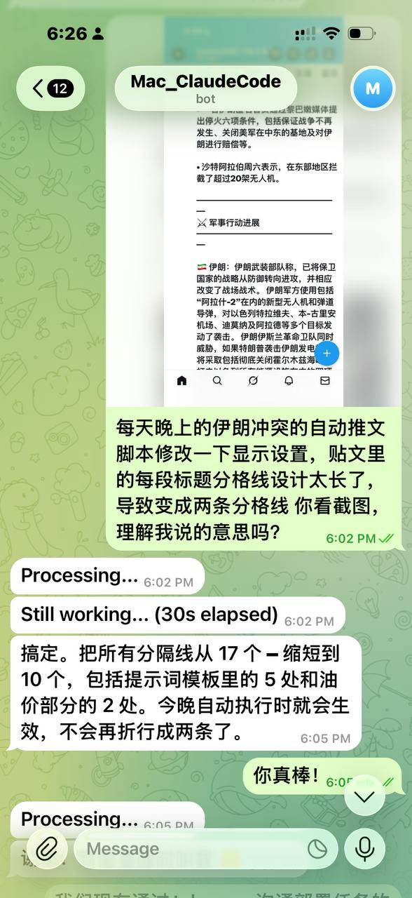

# ClaudeGram

> Control [Claude Code](https://docs.anthropic.com/en/docs/claude-code) CLI from your phone via Telegram. Use your existing Claude Max/Pro subscription — no API tokens needed.
>
> 通过 Telegram 在手机上远程操控本地 [Claude Code](https://docs.anthropic.com/en/docs/claude-code) CLI。使用现有的 Claude Max/Pro 订阅，无需额外 API 费用。

<p align="center">
  
</p>

## Why? / 为什么用这个？

- **Free / 免费** — Uses your Claude Max subscription, not pay-per-token API / 用 Max 订阅额度，不烧 API token
- **Mobile / 手机操控** — Deploy code, fix bugs, manage servers from your phone / 随时随地部署代码、修 bug、管理服务器
- **Persistent sessions / 会话连续** — Conversations maintain context across messages / 跨消息保持上下文
- **Files & images / 文件支持** — Send screenshots or files directly to Claude / 直接发送截图或文件给 Claude
- **Single file / 极简** — ~300 lines of Python, no framework bloat / 单文件 ~300 行 Python，无框架依赖

## How it works / 工作原理

```
Phone (Telegram) → Telegram API → bot.py (your Mac/Linux) → Claude Code CLI
手机 (Telegram)  → Telegram API → bot.py (你的 Mac/Linux) → Claude Code CLI
```

The bot long-polls the Telegram API, forwards your messages to the local Claude Code CLI, and sends back the response. Claude runs locally with full access to your filesystem, git, and terminal.

Bot 通过长轮询获取 Telegram 消息，转发给本地 Claude Code CLI 执行，然后返回结果。Claude 在本地运行，完整访问你的文件系统、git、终端。

## Quick Start / 快速开始

### Prerequisites / 前置条件

- Python 3.11+
- [Claude Code CLI](https://docs.anthropic.com/en/docs/claude-code) installed and authenticated / 已安装并登录
- A Telegram bot token from [@BotFather](https://t.me/botfather) / 从 @BotFather 获取 Bot Token

### Setup / 安装

```bash
git clone https://github.com/yourusername/claudegram.git
cd claudegram

pip install -r requirements.txt

cp .env.example .env
# Edit .env with your bot token and Telegram user ID
# 编辑 .env，填入你的 bot token 和 Telegram user ID
```

**Get your Telegram user ID / 获取 Telegram User ID:** Message [@userinfobot](https://t.me/userinfobot) on Telegram.

### Run / 运行

```bash
python bot.py
```

### Auto-start on macOS / macOS 开机自启（optional / 可选）

```bash
chmod +x setup_launchd.sh
./setup_launchd.sh
```

This creates a LaunchAgent that starts the bot on login and restarts it if it crashes.

创建 LaunchAgent，登录时自动启动，崩溃自动重启。

## Commands / 命令

| Command / 命令 | Description / 说明 |
|----------------|-------------------|
| `/new` | Start new session / 开始新会话 |
| `/status` | Show bot status / 查看状态 |
| `/stop` | Kill running task / 终止运行中的任务 |
| `/cd <path>` | Change working directory / 切换工作目录 |
| `/help` | Show help / 帮助信息 |

Any other text is sent directly to Claude as a prompt. You can also send images and files.

直接发文字就是和 Claude 对话，也可以发图片和文件。

## Configuration / 配置

All config via environment variables (`.env` file) / 所有配置通过环境变量（`.env` 文件）：

| Variable / 变量 | Required / 必填 | Default / 默认值 | Description / 说明 |
|-----------------|----------------|------------------|-------------------|
| `TELEGRAM_BOT_TOKEN` | Yes / 是 | — | Bot token from @BotFather |
| `ALLOWED_USER_ID` | Yes / 是 | — | Your Telegram user ID (security: only you can use the bot) / 你的 Telegram 用户 ID |
| `CLAUDE_PATH` | No / 否 | `claude` | Path to Claude CLI binary / Claude CLI 路径 |
| `DEFAULT_CWD` | No / 否 | `$HOME` | Default working directory / 默认工作目录 |
| `CLAUDE_TIMEOUT` | No / 否 | `300` | Max seconds per Claude invocation / 每次调用超时秒数 |

## Security / 安全

- **Single-user only / 单用户** — Only the `ALLOWED_USER_ID` can interact with the bot / 只有指定用户可以使用
- **Local execution / 本地执行** — Claude runs on your machine, nothing sent to third-party servers / Claude 在本地运行，不发送数据到第三方服务器
- **No API key needed / 无需 API Key** — Uses Claude Code's built-in authentication / 使用 Claude Code 内置认证

## License / 许可证

MIT
